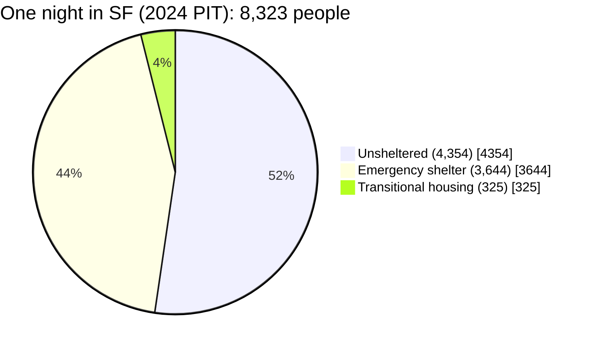
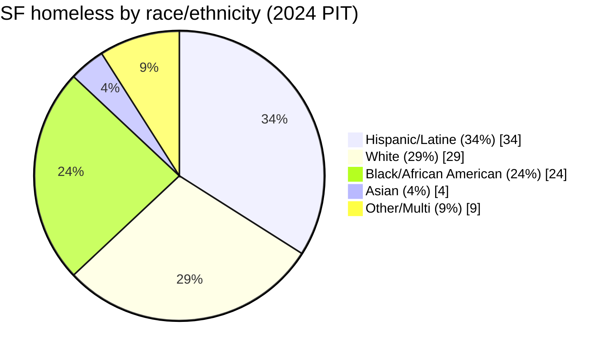

# Who Is on the Street in San Francisco? A Persona-Lens Population Profile

*Team brief — compiled June 23, 2026. Third pillar alongside [sf-1.md](docs/sf-1.md) (how cities segment & serve SUD personas) and [sf-substance-use-data-analysis.md](docs/sf-substance-use-data-analysis.md) (the three-lens substance breakdown). Research plan: [sf-street-population-research-plan.md](sf-street-population-research-plan.md).*

---

## How to read this document

> **📐 How to read the counts.** *"Experiencing homelessness"* is an umbrella covering two groups:
> - **Unsheltered** — sleeping on the street, in a vehicle, or a tent. **This is what we mean by "on the street."**
> - **Sheltered** — staying in *temporary* emergency shelter or transitional housing on the night of the count. **Sheltered does not mean housed** — these people still have no home of their own; they are just indoors that night.
>
> So a headline total (e.g., **8,323** in 2024) = **unsheltered + sheltered**. People in **permanent** housing — including **HUD-VASH** — have *exited homelessness* and are **not** in the total.
>
> | Housed — **not** in the count | Experiencing homelessness — **in** the count |
> |---|---|
> | Stably housed · Permanent supportive housing / HUD-VASH | **Sheltered** (temporary) · **Unsheltered** ("on the street") |

**None of these questions has an authoritative answer.** Every figure below is labeled with **what it measures, its year, its source, and a confidence level.** Three rules govern the whole brief:

1. **Three different "how many" numbers, never blended** — a *one-night count* (PIT), an *annual served count* (HMIS/DPH), and a *survey-estimated share* are all "correct" and all different. We say which one each figure is.
2. **Personas overlap — percentages are not additive.** "51% substance use + 51% mental health + 35% chronic" are overlapping flags on the same people, not separate groups to be summed.
3. **San Francisco is the subject; California (CASPEH) is comparison only**, flagged as such wherever it appears.

**Confidence key:** 🟢 High (representative SF count/survey) · 🟡 Medium (SF administrative or single-survey) · 🔴 Low (modeled, proxy, or assembled from indicators).

> ⚠️ **The 2026 count changed methodology.** The 2026 PIT switched to a *morning* count that *asked* people their housing status rather than *visually assuming* it ([SF Standard](https://sfstandard.com/2026/05/12/san-francisco-point-in-time-homeless-count/)). This plausibly drove the headline unsheltered "drop," so **2024→2026 trends are confounded.** We lead with 2026 for size and with the fuller **2024** data for everything else (the 2026 demographic report lands "later summer 2026").

---

## TL;DR — persona snapshot

| Dimension | Best estimate | What it measures (denominator, year) | Conf. |
|---|---|---|---|
| **Total homeless, one night** | **7,973** (2026); 8,323 (2024) | PIT one-night count, SF county | 🟡 |
| **— Unsheltered ("on the street")** | **3,400** (2026); 4,354 (2024) | PIT, unsheltered subset | 🟡 |
| **— Sheltered** | 57% (2026); 48% (2024) | PIT | 🟡 |
| **Served over a full year** | **~26,634 individuals / 20,236 households** (2024) | HSH administrative, annual | 🟢 |
| **Hard drug users (wider lens)** | **~37,500** total — only **~10% unsheltered**, ~90% housed in some form | UCSF/SFDPH capture-recapture 2025 (housing split modeled) | 🟡 / 🔴 |
| **Housed but still unstable/outside** | *No clean count* — ~16,514 in HSH housing carry high acuity; ~90% of the 37,500 drug users are housed, yet 23% of OD deaths occur *inside* PSH | HSH 2024; OCME 2020–25 | 🔴 |
| **Substance use** | **51%** self-report drug/alcohol (SF); ≥16,671 have a diagnosed SUD/SMI | PIT survey 2024; DPH 2024 | 🟡 |
| **— Drug mix** | Treatment entry: opioid + meth + alcohol co-lead; deaths: fentanyl ~71–75% | SFDPH / OCME (see substance brief) | 🟡 |
| **Mental health (any)** | **51%** self-report psychiatric/emotional (SF) | PIT survey 2024 | 🟡 |
| **Mental health (serious, disabling)** | **~50% of the 16,671 diagnosed cohort** carry a serious-MI diagnosis (≈8,300+) | DPH 2024, narrow clinical def. | 🟡 |
| **Chronically homeless** | **2,989 = 35%** | PIT 2024, HUD chronic definition | 🟢 |
| **Duration / first episode** | SF: 38% first became homeless at 25+; CA median 22 months, 39% first episode | PIT 2024; CASPEH statewide | 🟡 |
| **Prior service contact** | Annual-served (26.6k) ≈ **3.2× the one-night count** ⇒ most cycle through services | HSH 2024 | 🟡 |
| **Demographics** | 47% aged 25–44; 59% men; 24% Black (≈5× city share); 28% LGBTQ+ (≈2.3× city) | PIT survey 2024 | 🟢 |

---

## 1. How many?

Three numbers, three meanings:

- **One night (the headline):** **7,973** people were counted as homeless in the **2026** PIT (preliminary), of whom **3,400 were unsheltered** and **57% were sheltered** — the highest sheltered share recorded ([2026 PIT preliminary](https://www.sf.gov/2026-point-in-time-count-preliminary-results)). In **2024** the comparable figures were **8,323 total / 4,354 unsheltered / 48% sheltered** ([2024 PIT report](https://media.api.sf.gov/documents/2024_San_Francisco_Point-in-Time_Count_Report_8_13_24.pdf)). 🟡 *Caveat: the 2026 methodology change (above) makes the 22% unsheltered "drop" non-comparable.*
- **Over a full year:** the City served **~26,634 individuals (20,236 households)** experiencing homelessness across 2024 — roughly **3.2× the one-night number** ([2025 Homelessness Needs Assessment](https://media.api.sf.gov/documents/2025_Homelessness_Needs_Assessment.pdf), citing HSH admin). 🟢 This is the better number for "how many people touch homelessness in SF," because the one-night count misses everyone not outside/in-shelter on that specific night.
- **The shape of the problem is inflow.** For roughly every 1 person who exits homelessness, ~3 become homeless (2024 PIT, via Needs Assessment). 🟡 Shelter/housing capacity covered only ~50% of need on PIT night (4,440 beds). 🟢
- **The system is essentially full.** A recent City scorecard reports **~27,463 people receiving services** in a typical month (through April 2026), with **shelter and permanent supportive housing both ~90% occupied** ([HRS Scorecard](https://www.sf.gov/resource--2024--homelessness-response-system-scorecard)). 🟡 Maxed capacity is why inflow can't be absorbed.

**"On the street" = the unsheltered subset (~3,400–4,354).** That is the population most loaded with the addiction, mental-health, and chronicity flags below; whenever a stat uses the *all-homeless* denominator instead, we say so.

---

## 2. Housed, but still on the street? (the hard one)

**There is no authoritative count of people who have housing yet sleep outside often.** 🔴 This is the question the data is worst at. What we *can* assemble:

- **A wider lens reframes the whole question.** SF has an estimated **~37,500 hard drug users** (daily/near-daily opioid or stimulant use; UCSF/SFDPH capture-recapture, Wesson, via SF Chronicle, May 2025) — roughly **4.5× the homeless count**. Of them, only **~10% (~3,750) are unsheltered**; the other **~90% are housed in some form** (private housing, supportive housing/SRO, or shelter). 🔴 *The precise "59% private / 30% city-funded / 10% unsheltered" split is a **modeled estimate** by the Seibel fact sheet, not from the UCSF study, and its own footnote does not fully reconcile (its sub-categories sum to >100% and the "private" count is ~47%, not 59%). Use only the directional finding: most hard drug users are housed; only ~1 in 10 is on the street.* This is the clearest evidence that the visible street-drug population is the **tip of a much larger, largely-housed iceberg** — the persona this question is really chasing.
- **Housed does not mean safe.** ~**55% of permanent-supportive-housing (PSH) tenants have a diagnosed SUD**, and **23% of all SF overdose deaths in 2020–25 — 959 of 4,090 — occurred *inside* PSH units** (OCME via The Voice of SF, 2026; SFDPH PHACS). 🟡 State law (Welfare & Institutions Code §8255) bars removing PSH tenants for drug use, so PSH increasingly houses active users without resolving addiction — people are housed *and* dying indoors. This is the housed-but-still-in-crisis population, made concrete.
- **But formal returns are low.** Only **8% of people return to homelessness** after exiting (FY2025; [HRS Scorecard](https://www.sf.gov/resource--2024--homelessness-response-system-scorecard)) — most housing placements actually *stick*. 🟡 So this population is less about formally cycling back to the street and more about **active addiction or illness persisting *in place*** (the PSH-overdose figure above). Both are true: exits hold, yet "housed" ≠ "stable."
- The City served **~16,514 individuals (12,458 households)** in its **housing programs** in 2024 ([Needs Assessment](https://media.api.sf.gov/documents/2025_Homelessness_Needs_Assessment.pdf), HSH admin). 🟢 These people are *housed through the system* — the pool in which "housed but still outside" would occur.
- Among **housed** single adults, behavioral-health acuity stays high — roughly half still carry substance-use or mental-health conditions, and a PSH qualitative review (Focus Strategies, 2023, via Needs Assessment) reports **rising acuity, "new and stronger substances," and providers lacking capacity** to keep people stable. 🟡 Substance use is one of the largest drivers of premature, negative exits *back* to the street ([PSH exit study](https://www.ncbi.nlm.nih.gov/pmc/articles/PMC11178000/); see [sf-1.md](docs/sf-1.md)). 🟡
- The substance brief identifies the specific persona this question is really chasing: the **partly-housed, service-resistant stimulant user** — mobile, awake, dispersed — who is systematically *missed* by visual street counts and underserved because meth has no medication treatment ([sf-substance-use-data-analysis.md](docs/sf-substance-use-data-analysis.md)). 🟡

**Bottom line:** the honest answer is a *mechanism*, not a number — housing placement does not resolve addiction or serious mental illness. The drug-user lens shows the scale (only ~10% of users are unsheltered; the rest are housed but many still in active crisis), and the PSH-overdose figure shows the consequence (people housed *and* dying indoors). A clean count of "housed but sleeps outside often" still needs a returns-to-homelessness / PSH-exit analysis from HSH's ONE System, flagged as a follow-up.

---

## 3. Acute addiction — and which drugs

**How many:** **51%** of surveyed homeless people self-reported drug or alcohol use as a health condition (2024 PIT, n≈813–845; statistically flat vs. 2022's 52%). 🟢 Separately, DPH identified **≥16,671 homeless individuals carrying a diagnosed substance-use and/or serious-mental-illness condition** (service-touching, 2024), of whom **84% had an SUD diagnosis** (50% SUD-only + 34% co-occurring) ([Needs Assessment](https://media.api.sf.gov/documents/2025_Homelessness_Needs_Assessment.pdf), DPH MHSF). 🟡 *Statewide comparison: CASPEH found 35% reported regular illicit drug use (≥3×/week) — [CASPEH](https://homelessness.ucsf.edu/our-impact/studies/california-statewide-study-people-experiencing-homelessness).*

**Which drugs (the three-lens reframe — full detail in [the substance brief](docs/sf-substance-use-data-analysis.md)):** what you *see*, what is *prevalent*, and what *kills* diverge:

| Lens (what it measures) | SF picture | Source/year |
|---|---|---|
| **Treatment entry** (who enrolls) | **Opioids + methamphetamine + alcohol co-lead** — not opioid-only | SFDPH FY2020-21 🟡 |
| **Prevalence** (regular use) | Polysubstance; meth heavily present (statewide CASPEH 32% meth / 11% opioid — *does not describe SF*, see brief) | CASPEH 2021-22 🟡 |
| **Mortality** (who dies) | **Fentanyl-dominant: ~71–75% of overdose deaths**; meth/cocaine present as co-factors in ~half | OCME 2023-25 🟡 |

Key point for the team: **meth is the quiet, underserved persona** — major in treatment entry and present in half of deaths, but invisible in opioid-centric treatment metrics because no medication exists for it (contingency management is the only evidence-based tool). 🟡

**Overdose deaths are falling, but overdoses may not be.** SF recorded **810 (2023) → 635 (2024) → ~626 (2025)** overdose deaths (OCME; DataSF, updated April 2026). A primary driver of the decline is **Narcan saturation** — ~158,000 doses distributed annually, enabling ~6,893 documented peer reversals + ~2,640 paramedic administrations — *not* fewer people overdosing (Seibel fact sheet, SFDPH). 🟡 Falling mortality is a fourth distinct lens — don't read it as a shrinking drug-using population.

---

## 4. Mental health — a ladder, not one number

Mental health must be read on **two axes**: clinical *severity* and legal *compellability*. They don't line up, and the gap is where the visible crisis lives.

### Severity ladder (widest → narrowest)
| Rung | SF figure | Reactive to homelessness? | Source |
|---|---|---|---|
| Any psychiatric/emotional condition (self-report) | **51%** | **Partly — would fall with housing** | PIT 2024 🟢 |
| Condition functionally limiting (can't work/house/self-care) | **42%** (all conditions, not MH-only) | partly | PIT 2024 🟢 |
| **Serious mental illness, diagnosed** (psychotic, bipolar, PTSD, or depression w/ psychiatric inpatient episode) | **~50% of the 16,671 diagnosed cohort ≈ 8,300+ people** | **mostly no — disabling** | DPH 2024 🟡 |
| Treatment-disengaged / "stopped meds" SMI | *no clean count* | no | proxy only 🔴 |

*Statewide comparison: CASPEH found 66% reported any current mental-health condition, but only 18% of them received any non-emergency MH treatment in the prior 30 days — [CASPEH](https://homelessness.ucsf.edu/our-impact/studies/california-statewide-study-people-experiencing-homelessness).* 🟡

**Why the top of the ladder matters most:** the self-reported 51% is partly *reactive distress* — being unsheltered is independently anxiety- and depression-inducing, and such symptoms decline once people are housed. The **disabling** population is the DPH serious-MI cohort (~8,300+), defined clinically, not by a symptom screen. That is the "can't hold a job / stopped taking meds" group the team usually means.

### Compellability axis — and the "missing middle"
**5150 is a *legal* threshold, not a severity one** (it requires *imminent* danger or grave disability, for 72 hours). This splits the seriously-ill population into three operational groups:
- **5150 / conservatorship-eligible** — a legal door to care exists (even if revolving).
- **The "missing middle"** 🔴 — visibly symptomatic, disorganized, disruptive (yelling, erratic) but *not imminently dangerous and subsisting*, so **entitled to refuse all services with no compulsion lever.** Operationally the hardest group, and probably what the public means by "mentally ill on the street." This is exactly the population **SB-43 and CARE Court** were built to reach (see [sf-1.md](docs/sf-1.md)).
- **Reactive / lower distress.**

**Measurement gap:** 5150 holds and conservatorships are counted (LPS data); the missing middle has **no registry** — proxy only (911/311 behavioral calls, police CIT contacts, street-medicine/HOT-team logs). *Flagged follow-up: pull SF 5150 and conservatorship counts to bound the top of this axis.* Note the **overlap with §3**: meth-induced agitation/psychosis presents here and gets filed by observers as "mental illness" — count the overlap, don't double-count.

**The legal levers meant to reach this group are barely deployed — now quantified.** Of **369 people referred under the expanded SB-43 conservatorship criteria since January 2024, only 44 were conserved — and *zero* for substance use alone** (SF Standard, July 2025, citing SF HSA / Dept. of Disability & Aging Services). And SF prosecutors filed just **4 Proposition 36 felony treatment-mandate cases in all of 2025** — vs. 910 in Stanislaus County, a county two-thirds SF's size (Seibel fact sheet, Judicial Council 2026). 🟡 So the missing middle isn't just unmeasured — the tools built to compel its care are effectively unused.

---

## 5. How long have people been out there?

- **Chronically homeless: 2,989 people = 35% of the population** (2024 PIT, HUD definition: 12+ months or 4+ episodes plus a disabling condition). 🟢 Stable vs. 2022; reports rose 11% in absolute terms.
- **Onset age:** 27% first became homeless as a child (<18), 35% as a young adult (18–24), and **38% at age 25 or older** (PIT 2024 survey, n=919). 🟢 So a majority first fell into homelessness *before* age 25.
- **Foster-care history: 26%** of all respondents (PIT 2024) — a strong early-life pathway signal. 🟢
- *Statewide comparison (CASPEH): median length of homelessness **22 months**; only **39% were in their first episode**.* 🟡 SF-specific median duration isn't published in the same form; the 35% chronic share is the firmest SF anchor.

---

## 6. How likely is prior service contact?

Very likely — most people on the street are already *known to the system*:

- The **annual-served count (26,634) is ~3.2× the one-night count (8,323)** — the population churns through outreach, shelter, and services across a year (HSH 2024). 🟡
- The DPH behavioral-health cohort (16,671) is *defined by* having "used City housing or health-care services in the past two years." 🟢 (within that cohort)
- But **service contact ≠ stable exit:** only **13% of shelter clients exited to permanent housing**, and **51% of shelter-leavers have no recorded destination at all** ([2025 Shelter System Assessment](https://media.api.sf.gov/documents/CON_Shelter_Assessment_Report.pdf)). 🟡
- **The exit pipe is narrow and slow.** Recent monthly averages: **~433 exits from homelessness**, but an average **218 days (~7 months)** from entering the system to moving into housing; **~494 people/month** get prevention help to stay housed ([HRS Scorecard](https://www.sf.gov/resource--2024--homelessness-response-system-scorecard)). 🟡 With shelter and PSH ~90% full, there is nowhere to move people *to*.
- *Statewide comparison (CASPEH): two-thirds of people sought no help from anyone before becoming homeless* — the gap is **upstream prevention**, not downstream contact. 🟡

- **Contact ≠ treatment capacity.** SF has only **607 substance-use treatment beds for ~37,500 hard drug users**, and **fewer than 1% are on sustained opioid medication** at any time (only 210 stayed on it 6 months in FY24-25) (Seibel fact sheet, SFDPH). 🟡 A new on-demand telehealth program is the bright spot (1,923 served in nine months, half starting medication). **The treatment itself works** — medication cuts overdose death 38–59% ([NIH](https://www.nih.gov/news-events/news-releases/methadone-buprenorphine-reduce-risk-death-after-opioid-overdose)) — it just reaches almost no one.
- **For serious mental illness, it's an intensity gap.** SF's public system *does* reach people for general mental-health care — **~13,886 individuals received a mental-health service in February 2026** (SFHN/BHS, any diagnosis/setting; [SFDPH dashboard](https://www.sf.gov/data--mental-health-treatment)). But the **intensive model proven to work** — Full Service Partnerships, which cut clients' days-homeless from ~191 to ~62 a year ([Gilmer et al. 2010, *Arch. Gen. Psychiatry*](https://jamanetwork.com/journals/jamapsychiatry/fullarticle/210805), San Diego County; corroborated statewide by [RAND 2024](https://www.rand.org/pubs/research_reports/RRA3105-1.html): +128 days stable housing) — enrolls just **488 people citywide** (~3.5% of those in care; [CA Accountability, Feb 2026](https://www.accountability.ca.gov/county/san-francisco/behavioral-health/)), against ~8,300 homeless adults with a diagnosed SMI. *(Note the two are different time-bases: the ~8,300 is a 2-year diagnosed cohort, the 488 a point-in-time snapshot.)* 🟡

**Interpretation:** "received services in the past" is near-universal once someone is chronically on the street. The failure mode is **reach and intensity, not first contact**: effective treatment exists and works — medication cuts overdose death, FSP reverses homelessness — but the tiers that actually resolve addiction and disabling mental illness reach only a sliver (**210** retained on medication; **488** in FSP), so few get the care that works or stay in it.

---

## 7. Demographic makeup

All figures from the **2024 PIT** count/survey (n=956 survey, ±3% at 95% confidence) unless noted. 🟢 Compared against SF's 2020 Census baseline.

**Age** — concentrated in mid-adulthood: <18 (7%), 18–24 (14%), **25–34 (20%), 35–44 (27%)** [= 47% aged 25–44], 45–54 (17%), 55–64 (10%), 65+ (5%).

**Gender** — men 59%, women 32%, **transgender + non-binary + multiple ~6%** (trans 2%, non-binary 2%, more-than-one 2%). Trans/gender-nonconforming rose from 4% (2022) to ~9% by some measures — a population HSH flags as especially vulnerable.

**Sexual orientation** — straight 72%, bisexual 11%, gay/lesbian/same-gender-loving 9%, questioning 5%. **Total LGBTQ+ ≈ 28% — vs. ~12% of the city** (≈2.3× overrepresented). LGBTQ+ respondents were likelier to have first become homeless as youth and to report domestic violence.

**Race/ethnicity** — White 29%, **Black/African American/African 24%, Hispanic/Latine 34%** (incl. combined), Asian 4%. Against a city that is ~5% Black, **Black residents are roughly 5× overrepresented** — the single starkest disparity. Latino is also overrepresented (city ~16%); Asian is underrepresented. *(These are PIT all-persons counts, with Hispanic/Latino as its own category. SF administrative data — HSH, heads of household — puts the Black share higher still: **33% of single adults, 40% of families** (2025 Needs Assessment, p.12), reflecting a different source and a separate race/ethnicity coding. So the ~5× is the conservative read.)*

**Other markers:** 20% currently experiencing domestic violence (51% lifetime); 59% were last housed in San Francisco (i.e., majority are local, not in-migrants); 32% had been in SF under a year before becoming homeless.

**Primary self-reported cause of homelessness:** lost job 22%, alcohol or drug use 19%, eviction 14%, argument with family/friend 11%, divorce/separation 9%, mental-health issues 7% (PIT 2024). 🟢 Note substance use and mental health together account for ~26% of *self-attributed* primary causes — far below their *prevalence* (51% each), underscoring that prevalence ≠ cause.

---

## 8. The segmentation lens — and why veterans/youth fell in 2026

The persona view isn't just analysis; it's how the system funds and acts (see [sf-1.md](docs/sf-1.md): Built for Zero, by-name lists, "fund the cleanest population first"). SF's 2026 count looks like that thesis in its own numbers — the steepest declines hit exactly the populations with **dedicated funding streams and targeted 100-Day Challenges**:

| Population | 2026 change | Why it's "fundable" |
|---|---|---|
| **Veterans** | **−44%** (327; unsheltered vets −55%) | HUD-VASH / SSVF dedicated federal money |
| **Youth / TAY** | **−54%** | Targeted youth funding + challenge cohort |
| **People in families** | **+34%** (1,474) | No clean dedicated stream; rising inflow |
| Chronic single adults (behavioral-health core) | moved least | Hardest to fund/house; highest acuity |

🟡 *Verify against the full 2026 report and the methodology caveat before leaning hard on these.* The takeaway for resourcing: **measured progress concentrates where targeted funding exists** — and the hardest-to-fund single-adult, behavioral-health-complex core is what remains most visibly on the street.

---

## 9. Limitations & methodology

- **PIT undercounts the unsheltered** and is one night; it misses the mobile, partly-housed, and "invisible" (esp. stimulant users and families in vehicles).
- **2026 methodology break** (morning + ask-don't-assume) confounds 2024→2026 comparisons; treat the unsheltered "drop" cautiously.
- **2024 vehicular-homelessness counting change** inflated family figures vs. prior years.
- **Self-report bias** runs through every survey percentage (51% substance use, 51% mental health, causes).
- **Denominator switching** is the biggest interpretation trap — one-night (8,323) vs. annual-served (26,634) vs. diagnosed-cohort (16,671) vs. survey-subsample (956) are different universes.
- **Heads-of-household vs. individuals:** HSH demographic splits in the Needs Assessment are heads-of-household, not persons.
- **Cause ≠ consequence:** cross-sectional data can't separate disabling conditions that *drove* homelessness from distress *produced by* it (most acute for mental health, §4).
- **Persona overlap:** the dimensions are not additive — the same person appears in substance, mental-health, and chronicity counts at once.
- **Two different universes:** the *homeless* population (~8,323) and the *hard-drug-user* population (~37,500) are distinct sets that overlap mainly at the unsheltered street level (~3,400–4,354). Don't conflate them. The 37,500 housing split (59/30/10) is a modeled estimate with an internally inconsistent footnote — only its directional finding (~90% of users housed) is reliable.
- **Held out by choice:** non-resident / arrest-origin figures from the Seibel fact sheet (e.g., 47% of public-drug-use citations non-resident; 8% of Tenderloin arrestees SF residents) describe the *cited/arrested* population — a third universe — partly rest on unreleased internal data, and sit in tension with the PIT finding that **59% of homeless were last housed in SF**. Omitted here pending a deliberate decision to include them.
- **CASPEH is statewide (2021–22)**, used only as a benchmark; the substance brief shows why its drug split does not describe SF.
- **Charts here are a first pass** drawn on the figures we trust; Low-confidence items (§2, the missing middle in §4) are intentionally *not* charted.

---

## Sources

**SF Point-in-Time counts**
- 2026 PIT preliminary results: https://www.sf.gov/2026-point-in-time-count-preliminary-results
- 2024 PIT Count report (PDF): https://media.api.sf.gov/documents/2024_San_Francisco_Point-in-Time_Count_Report_8_13_24.pdf
- 2024 PIT landing page: https://www.sf.gov/reports--september-2024--2024-point-time-count
- Methodology-change coverage (SF Standard): https://sfstandard.com/2026/05/12/san-francisco-point-in-time-homeless-count/

**SF synthesis & administrative**
- SF Controller — 2025 Homelessness Needs Assessment (PDF, Dec 2025): https://media.api.sf.gov/documents/2025_Homelessness_Needs_Assessment.pdf
- SF Controller — 2025 Assessment of the SF Shelter System (PDF, Mar 2025): https://media.api.sf.gov/documents/CON_Shelter_Assessment_Report.pdf
- HSH Homelessness Response System monthly report: https://www.sf.gov/data/homelessness-response-system-monthly-report
- HSH Homelessness Response System **Scorecard** (system-flow metrics — served, exits, days-to-housing, returns, occupancy): https://www.sf.gov/resource--2024--homelessness-response-system-scorecard
- HSH research & data hub: https://hsh.sfgov.org/about/research-and-reports/hrs-data/

**Behavioral health / substance use (see companion brief for full list)**
- [sf-substance-use-data-analysis.md](docs/sf-substance-use-data-analysis.md) — SFDPH treatment entry & OCME mortality, three-lens method
- SFDPH substance use services: https://www.sf.gov/data/substance-use-services
- SF OCME overdose deaths: https://www.sf.gov/data--preliminary-unintentional-drug-overdose-deaths

**Hard-drug-user population & drug-crisis context**
- Seibel — *San Francisco Drug Crisis: Fact Sheet* (2025–26) — a privately circulated compilation; **not redistributed in this repo**. It compiles the figures below from their primary sources (cited directly).
- UCSF/SFDPH capture-recapture (~37,500 hard drug users): Wesson, via SF Chronicle, May 16, 2025
- SB-43 conservatorship outcomes (369 referred / 44 conserved / 0 SUD-only): SF Standard, July 7, 2025 (SF HSA / DADS)
- Prop 36 filing data: Judicial Council of California, Prop 36 Court Implementation Report, March 2026
- PSH overdose share (23%, 959 of 4,090): OCME via The Voice of San Francisco, May 2026

**Statewide comparison (not SF headline figures)**
- UCSF BHHI — CASPEH study: https://homelessness.ucsf.edu/our-impact/studies/california-statewide-study-people-experiencing-homelessness
- CASPEH Behavioral Health report (PDF): https://homelessness.ucsf.edu/sites/default/files/2025-03/Behavioral%20Health%20Report.pdf
- California HDIS (statewide HMIS): https://bcsh.ca.gov/calich/hdis.html

**Segmentation framework** — see [sf-1.md](docs/sf-1.md) for the full Built for Zero / Houston / SB-43 / CARE Court source set.
