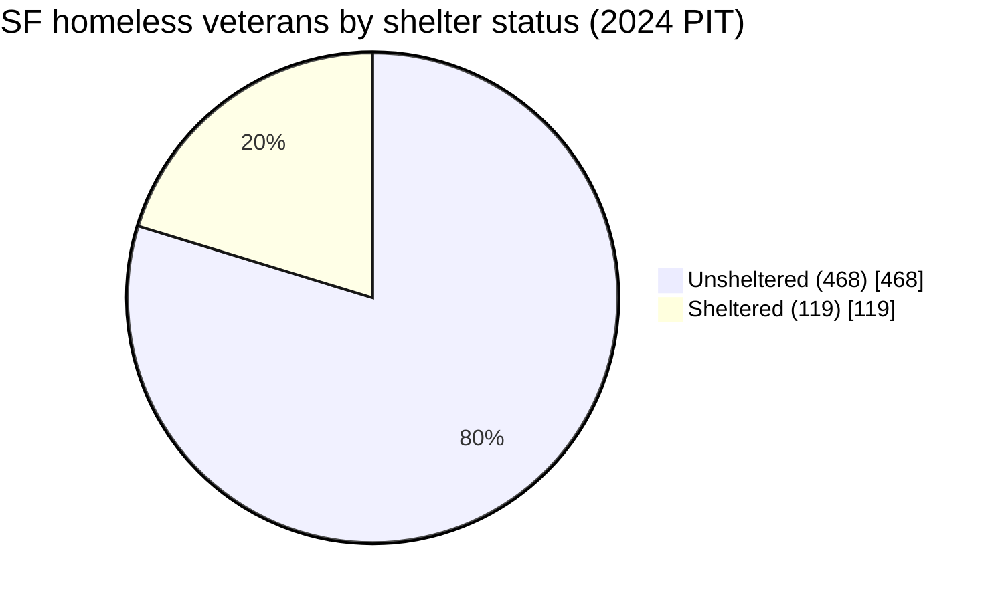

# Homeless Veterans in San Francisco — A Population & Funding Profile

*Team brief — compiled June 23, 2026. A focused companion to [sf-street-population.md](sf-street-population.md) (the full street-population profile) and [sf-1.md](docs/sf-1.md) (why cities target veterans first). Same citation discipline: every figure carries source + year + denominator + confidence.*

**Confidence key:** 🟢 High (representative count/admin) · 🟡 Medium (single source / definitional caveat) · 🔴 Low (proxy/modeled).

> **📐 How to read the counts.** *"Experiencing homelessness"* is an umbrella covering two groups:
> - **Unsheltered** — sleeping on the street, in a vehicle, or a tent. **This is what we mean by "on the street."**
> - **Sheltered** — staying in *temporary* emergency shelter or transitional housing on the night of the count. **Sheltered does not mean housed** — these people still have no home of their own; they are just indoors that night.
>
> So a headline total (e.g., **587** veterans in 2024) = **unsheltered + sheltered**. Veterans in **permanent** housing — including **HUD-VASH** — have *exited homelessness* and are **not** in the total (this is central to §3).
>
> | Housed — **not** in the count | Experiencing homelessness — **in** the count |
> |---|---|
> | Stably housed · Permanent supportive housing / HUD-VASH | **Sheltered** (temporary) · **Unsheltered** ("on the street") |

> **Why veterans get their own profile.** Veterans are the population cities target *first* — not because they're the largest, but because they have a clean "functional zero" definition and a **dedicated federal funding stream** (VA / HUD-VASH, SSVF) that no other group has. That makes them the most fundable, most measurable persona — and SF's recent numbers are the clearest place to watch the "segment-and-fund" thesis from [sf-1.md](docs/sf-1.md) actually move.

---

## 1. How many — three measures, three numbers

As with the overall population, the answer depends on *which* count:

| Measure (what it counts) | SF veterans | Source / year | Conf. |
|---|---|---|---|
| **One night (PIT)** | **327** (2026 prelim); **587** (2024) | SF PIT / HUD CoC | 🟡 |
| **Served over a full year (HMIS)** | **556** (2025); 682 (2024); peak **791** (2022) | CA HDIS, CA-501 | 🟢 |
| **Veteran-dedicated beds** | 76 emergency/TH + 1,437 permanent (mostly HUD-VASH) | 2024 HIC | 🟢 |

Note the measures don't agree, and shouldn't: the one-night PIT (587 in 2024) is smaller than the annual-served HMIS count (682 in 2024) because the annual figure captures everyone who cycled through services across the year. Both are correct.

---

## 2. The trend — falling on every lens (with one big caveat)

**One-night PIT count, with shelter status** (HUD CoC PopSub, CA-501 — the authoritative sheltered/unsheltered split):

| Year | Total | Sheltered | Unsheltered | % unsheltered |
|---|---|---|---|---|
| 2019 | 608 | 117 | 491 | 81% |
| 2022 | 605 | 201 | 404 | 67% |
| 2023 | 548 | 144 | 404 | 74% |
| 2024 | **587** | **119** | **468** | **80%** |
| 2026 (prelim) | **327** | — | — | (unsheltered −55% vs 2024) |

*Sources: [2024 SF PIT report](https://media.api.sf.gov/documents/2024_San_Francisco_Point-in-Time_Count_Report_8_13_24.pdf); HUD CoC PopSub CA-501 [2024](https://files.hudexchange.info/reports/published/CoC_PopSub_CoC_CA-501-2024_CA_2024.pdf) / [2023](https://files.hudexchange.info/reports/published/CoC_PopSub_CoC_CA-501-2023_CA_2023.pdf); [2026 PIT preliminary](https://www.sf.gov/2026-point-in-time-count-preliminary-results).* 🟡

**Annual-served, HMIS** (CA HDIS, CA-501 — the higher-frequency lens):

| 2017 | 2018 | 2019 | 2020 | 2021 | 2022 | 2023 | 2024 | 2025 |
|---|---|---|---|---|---|---|---|---|
| 570 | 650 | 748 | 782 | 787 | **791** | 755 | 682 | **556** |

*Source: [CA HDIS "Homelessness Count by Veteran Status"](https://data.ca.gov/dataset/homelessness-demographics) (downloadable CSV).* 🟢 The served count peaked in 2022 and has fallen ~30% to 2025 — **corroborating the PIT decline through an independent, annual data stream**, which matters because…

> ⚠️ **The 2026 PIT −44% drop is partly a methodology artifact.** The 2026 count switched to a morning, ask-don't-assume method ([SF Standard](https://sfstandard.com/2026/05/12/san-francisco-point-in-time-homeless-count/)). The HDIS annual series (which uses a *consistent* HMIS method) also declines — so the veteran drop is **directionally real**, even if the headline −44% overstates the one-night magnitude.

---

## 3. The defining feature: veterans are *more* unsheltered, and getting less sheltered

The most striking SF-specific finding: **80% of homeless veterans were unsheltered in 2024 (468 of 587)** — well above the ~52% unsheltered rate for the overall homeless population (PIT 2024). 🟢 And the sheltered share is *shrinking*: sheltered veterans fell **41%** from 2022 (201) to 2024 (119), even as the total held roughly flat.

### How "sheltered" and "veteran" are identified

The 587 total is built from **two different methods**, which matters for interpreting it:

- **"Sheltered" (119) is an administrative count, not street observation.** Sheltered veterans are identified from **HMIS records + direct surveys to shelter/TH providers** on the count night (Jan 30, 2024) — people physically in emergency shelter or transitional housing whose intake record carries a veteran flag ([2024 PIT report](https://media.api.sf.gov/documents/2024_San_Francisco_Point-in-Time_Count_Report_8_13_24.pdf), methodology note). 🟢
- **"Unsheltered" (468) is survey-derived and extrapolated** — people who self-identified as veterans in the PIT street survey, scaled to the unsheltered count, plus observational data. 🟡 So the unsheltered half rests on a smaller, noisier sample than the administrative sheltered half.
- **"Veteran" = self-reported active-duty U.S. Armed Forces service**, recorded at intake/survey, **not verified against VA records**. HUD counts this regardless of discharge status or length of service — broader than VA's own eligibility, so PIT veteran counts can exceed VA-eligible counts. 🟡

**Permanent housing — including HUD-VASH — is *not* "sheltered."** Veterans housed via VASH have exited homelessness and drop out of the PIT count entirely. That's why veteran *bed* inventory doesn't map onto the sheltered count: SF's **1,437** permanent veteran beds (mostly VASH) hold formerly-homeless veterans who are no longer counted, while only **76** beds are veteran-specific *emergency/TH*. Against those 76 shelter/TH beds, **119 sheltered veterans** simply means veterans also occupy general (non-veteran) beds — there is **no bed-shortage paradox**.

> **Correction:** an earlier draft of this doc mis-stated "847 dedicated veteran beds." **847 is SF's *youth* permanent-bed count**; veteran beds are 76 emergency/TH + 1,437 permanent ([2024 HIC](https://files.hudexchange.info/reports/published/CoC_HIC_CoC_CA-501-2024_CA_2024.pdf), via the [Needs Assessment](https://media.api.sf.gov/documents/2025_Homelessness_Needs_Assessment.pdf)).

**What this means for the decline:** the most likely driver is the VASH / permanent-housing mechanism — veterans housed *out* of the count — consistent with the funding lens in §4. Confirming it (genuine exits *to housing* vs. merely going *uncounted*) is the follow-up for HSH/VASH placement data.

---

## 4. Why the decline — the funding lens

Veterans are the one population with a purpose-built federal funding stack, which is the mechanism [sf-1.md](docs/sf-1.md) identifies behind veteran-first strategies:

- **HUD-VASH** — HUD Housing Choice Vouchers paired with VA case management (Housing First clinical support). The core engine.
- **SSVF** (Supportive Services for Veteran Families) — VA-funded prevention + rapid rehousing.
- **SF's 100-Day Challenge** — SF is in a state cohort explicitly targeting veterans (and youth) for accelerated functional-zero progress (per [HDIS / state](https://bcsh.ca.gov/calich/hdis.html) coverage).

This is the same logic Houston and Rockford used: a population with a clean definition *and* dedicated money is the one you can drive to "functional zero" first ([sf-1.md](docs/sf-1.md)). SF's veteran (−44% PIT) and youth (−54% PIT) being the two steepest 2026 declines — the two funded segments — is exactly the predicted pattern.

---

## 5. Demographics — a known gap

SF-specific demographic breakdowns *within* the veteran subpopulation (age, race, gender) are **thin in the public data**. 🔴 The HDIS veteran file is count-only (year × CoC); the SF PIT and HUD PopSub report veteran *totals* and shelter status but not veteran-specific age/race/gender cross-tabs. National AHAR data shows homeless veterans skew overwhelmingly older and male, but importing national demographics onto SF would violate the SF-first rule. **Flagged follow-up:** request a veteran demographic cut from HSH's ONE System, or mine the SF PIT survey microdata if the veteran subsample is large enough to be reliable.

---

## 6. Data sources (ranked by queryability)

1. **CA HDIS — "Homelessness Count by Veteran Status"** — downloadable CSV, **annual served, 2017–2025, by CoC (SF = CA-501)**. The structured time-series source. https://data.ca.gov/dataset/homelessness-demographics
2. **SF PIT Count veteran section** (HSH PDF, biennial) — one-night count *with* sheltered/unsheltered split and trend. https://media.api.sf.gov/documents/2024_San_Francisco_Point-in-Time_Count_Report_8_13_24.pdf
3. **HUD CoC PopSub reports** (CA-501, annual) — one-night veteran counts broken into Emergency Shelter / Transitional Housing / Unsheltered; nationally comparable. https://files.hudexchange.info/reports/published/CoC_PopSub_CoC_CA-501-2024_CA_2024.pdf
4. **HUD "PIT and HIC Data Since 2007"** master workbook — full multi-year veteran series for every CoC, plus HIC veteran bed inventory. https://www.hudexchange.info/resource/3031/pit-and-hic-data-since-2007/
5. **VA / HUD-VASH** — voucher allocation & utilization (the funding-stream lens); less SF-granular publicly.

---

## 7. Limitations

- **Three denominators** (one-night PIT vs. annual-served HMIS vs. bed capacity) are not interchangeable — labeled throughout.
- **2026 PIT methodology break** confounds the 2024→2026 one-night comparison; the HDIS annual series is the more method-stable trend.
- **"Veteran" definitions** can differ slightly between HUD PIT (self-report at count) and HMIS (administrative) — small discrepancies between the 587 PIT and 682 HMIS figures for 2024 partly reflect this, not just the one-night-vs-annual gap.
- **No reliable SF veteran demographic breakdown** — §5 is a gap, not a finding.
- **Sheltered and unsheltered veterans are counted by different methods** (administrative HMIS vs. extrapolated street survey — see §3); the two halves of the 587 are not equally precise.
- **Veteran *bed* inventory ≠ sheltered veterans**: permanent/VASH beds house veterans *out* of the count, so capacity and shelter figures shouldn't be compared directly (the apparent "paradox" in an earlier draft was a misread — §3 correction).

---

## Sources

- SF 2024 PIT Count report (PDF): https://media.api.sf.gov/documents/2024_San_Francisco_Point-in-Time_Count_Report_8_13_24.pdf
- SF 2026 PIT preliminary: https://www.sf.gov/2026-point-in-time-count-preliminary-results
- HUD CoC PopSub CA-501 2024 (PDF): https://files.hudexchange.info/reports/published/CoC_PopSub_CoC_CA-501-2024_CA_2024.pdf
- HUD CoC PopSub CA-501 2023 (PDF): https://files.hudexchange.info/reports/published/CoC_PopSub_CoC_CA-501-2023_CA_2023.pdf
- HUD "PIT and HIC Data Since 2007": https://www.hudexchange.info/resource/3031/pit-and-hic-data-since-2007/
- CA HDIS Homelessness Demographics (veteran CSV): https://data.ca.gov/dataset/homelessness-demographics
- 2026 PIT methodology coverage (SF Standard): https://sfstandard.com/2026/05/12/san-francisco-point-in-time-homeless-count/
- Funding & segmentation framework: [sf-1.md](docs/sf-1.md) · overall population: [sf-street-population.md](sf-street-population.md)
